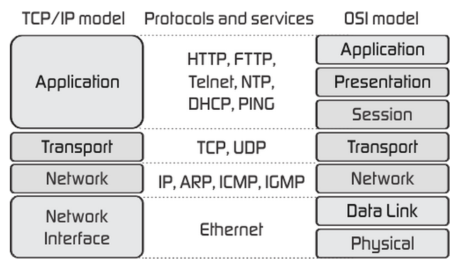

# 1주차 : 네트워크

- OSI 7 Layers + TCP/IP stack 과의 비교, 차이
- TCP 3 & 4 way handshake + TCP/IP 흐름제어 & 혼잡제어
- UDP
- 대칭키 & 공개키

## OSI 7 Layers + TCP/IP 4 Layers

- **TCP/IP** Application 계층 = **OSI** Application 계층 + Presentation 계층 + Session 계층
- **TCP/IP** Internet 계층 = **OSI** Network 계층
- **TCP/IP** Link 계층 = **OSI** Data Link 계층 + Physical 계층

### 애플리케이션 계층

- FTP, HTTP, SSH, SMTP, DNS 등 응용프로그램이 사용되는 프로토콜 계층

<aside>
💡 **FTP**

장치와 장치 간의 파일을 전송하는 데 사용되는 표준 통신 프로토콜

**SSH**

네트워크 서비스를 안전하게 운영하기 위한 암호화 네트워크 프로토콜

**HTTP**

World Wide Web을 이용하는 데 쓰는 프로토콜

**SMTP**

전자 메일 전송을 위한 인터넷 표준 통신 프로토콜

</aside>

### 전송 계층

- 송신자와 수신자를 연결하는 통신 서비스를 제공, 애플리케이션과 인터넷 계층 사이의 중간 역할
- TCP와 UDP가 대표적인 예

<aside>
💡 **TCP**

- 패킷 사이의 순서 보장 O
- 연결지향 방식
- 가상회선 패킷 교환 방식 사용

**UDP**

- 패킷 사이의 순서 보장 X
- 비연결지향 방식
- 데이터그램 패킷 교환 방식 사용
</aside>

**가상회선 패킷 교환 방식**

- 각 패킷에는 가상회선 식별자가 포함되며 모든 패킷을 전송하면 가상회선이 해제됨
- 패킷들은 **전송된 순서**대로 도착함

**데이터그램 패킷 교환 방식**

- 패킷이 독립적으로 최적의 경로를 선택하여 이동
- 여러 패킷이 서로 다른 경로로 전송될 수 있음
- **도착한 순서가 다를수 있음**

### TCP 연결 성립 과정

- 아래의 3-way handshake 과정을 진행하여 신뢰성을 구축함

1. SYN 단계 : 클라이언트는 서버에 클라이언트의 ISN(Initial Sequence Number)를 담아 SYN을 보낸다.
2. SYN + ACK 단계 : 서버는 클라이언트의 SYN을 수신하고 서버의 ISN을 보내며 승인번호로 클라이언트의 ISN + 1을 보낸다.
3. ACK 단계 : 클라이언트는 서버의 ISN + 1한 값인 승인번호를 담아 ACK을 서버에 보낸다.

### TCP 연결 해제 과정

- 아래의 4-way handshake 과정을 진행하여 연결을 해제함

1. 클라이언트가 연결을 닫으려고 할 때 FIN으로 설정된 세그먼트를 보낸다. 그리고 FIN_WAIT_1 상태로 돌입하고 서버의 응답을 기다림
2. 서버는 클라이언트로 ACK이라는 승인 세그먼트를 보내고, CLOSE_WAIT 상태로 돌입한다.
    
    클라이언트는 ACK을 받으면 FIN_WAIT_2 상태로 돌입한다.
    
3. 서버는 AKC을 보내고 일정 시간 이후에 클라이언트에 FIN이라는 세그먼트를 보낸다.
4. 클라이언트는 TIME_WAIT 상태가 되고 다시 서버로 ACK을 보내서 서버는 CLOSED 상태가 된다.
    
    이후 클라이언트는 **어느 정도의 시간을 대기**한 후 연결이 닫히고, 해제된다.
    

<aside>
💡 **TIME_WAIT 상태에서 왜 어느 정도의 시간을 대기할까?**

1. 지연 패킷이 발생할 경우를 대비하기 위함
2. 클라이언트와 서버 두 장치가 연결이 닫혔는지 확인하기 위해서이다.
</aside>

### 인터넷 계층

- 장치로부터 받은 네트워크 패킷을 IP 주소로 지정된 목적지로 전송하기 위해 사용되는 계층
- IP, ARP, ICMP 등이 있음

### 링크계층

- 전선, 광섬유, 무선 등의 매체를 통해 실질적으로 데이터를 전달하며, 장치 간에 신호를 주고받는 ‘규칙’을 정하는 계층

## TCP/IP 흐름제어 및 혼잡제어

[[네트워크] TCP/IP 흐름제어 & 혼잡제어 — 항상 끈기있게 (tistory.com)](https://nayoungs.tistory.com/entry/%EB%84%A4%ED%8A%B8%EC%9B%8C%ED%81%AC-TCPIP-%ED%9D%90%EB%A6%84%EC%A0%9C%EC%96%B4-%ED%98%BC%EC%9E%A1%EC%A0%9C%EC%96%B4)

## 대칭키 & 공개키(비대칭키)

### 대칭키 방식

양 측이 동일한 비밀 키를 공유하는 방식

**장점**

- 처리 속도 : 공개키 암호화에 비해 빠른 처리 속도를 가진다. 즉, 대규모 데이터 암호화에 더 적합하다.
- 알고리즘의 간결함 : 공개키 암호화 알고리즘보다 상대적으로 간단하다. 즉, 구현 및 유지 관리가 쉽다.
- 컴퓨팅 자원 소모량 : 공개키 암호화에 비해 적은 컴퓨팅 자원을 필요로 한다. 즉, 저성능의 하드웨어에서도 적합하다.

**단점**

- 키 배포 문제 : 통신 양측이 동일한 키를 공유해야한다. 이 키를 안전하게 전달하는 것은 별도의 보안 채널을 필요로 하며, 쉽게 침해될 수 있다.
- 키 관리의 어려움 : 참가자가 많아질수록 키 관리가 복잡해진다. 참가자 간의 모든 통신에 대해서 별도의 대칭키를 생성해야 하기 때문이다.

### 공개키 방식

비대칭키 방식이라고도 하며, 공개키는 공유하면서 개인키는 사용자만이 알고있는 비밀 키를 유지하는 방식

**장점**

- 키 배포 문제 해결 : 공개키를 사용하여 암호화하므로, 별도의 보안채널이 필요 없다.
- 키 관리의 효율성 : 사용자가 모두 공개키를 공유하기 때문에 키 관리가 간단하고 효율적이다.
- 디지털 서명 및 인증에 사용될 수 있다.

**단점**

- 처리 속도 : 대칭키 암호화에 비해 처리 속도가 느리다. 즉, 대규모 데이터 암호화에는 부적합할 수 있다.
- 컴퓨팅 자원 소모량 : 대칭키 암호화에 비해 더 많은 컴퓨팅 자원을 필요로 한다. 즉, 높은 성능의 하드웨어가 요구될 수 있고, 저성능 하드웨어에서는 성능 저하가 발생할 수 있다.
- 알고리즘의 복잡성 : 대칭키 암호화에 비해 알고리즘이 더 복잡하다. 즉, 구현 및 유지 관리가 어렵고, 알고리즘에 취약점이 발견되면 전체 시스템의 보안에 위협이 될 수 있다.

## 결론

대칭키는 보안보다는 빠른 처리 속도와 효율성이 필요한 상황에 적합하며, 공개키 방식은 키 배포 및 관리를 더 중요시 여기는 상황에 적합하다.

이 둘의 응용으로,

공개키 방식을 사용하여 대칭키를 안전하게 교환한 후, 이 대칭키를 이용하여 데이터를 대칭키 방식으로 암호화하고 복호화한다. 이렇게 함으로써 키 배포 문제와 처리 속도 문제를 모두 해결할 수 있다.

## 인용 자료

[🔑대칭키 VS 공개키 (기본개념,비교) (tistory.com)](https://jun27.tistory.com/61)

도서 : 면접을 위한 CS 전공지식 노트 - 주홍철
